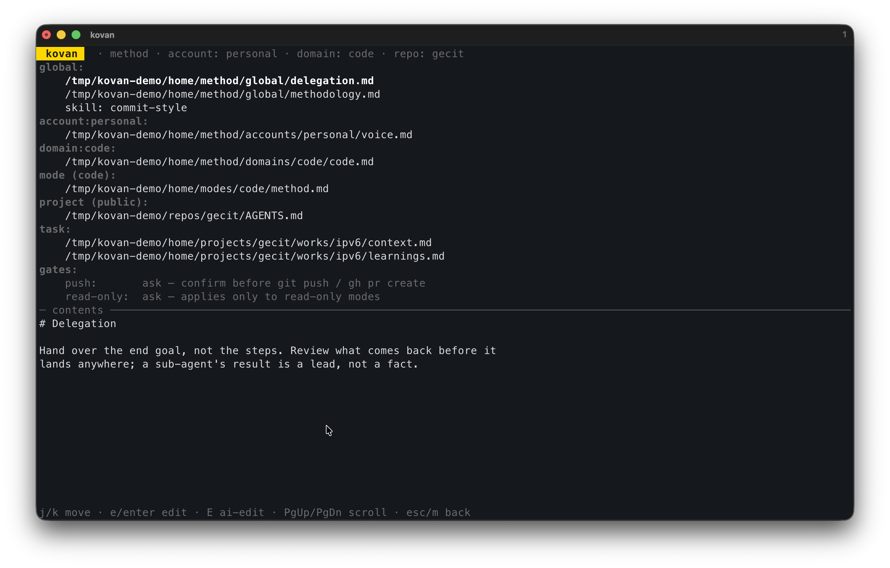
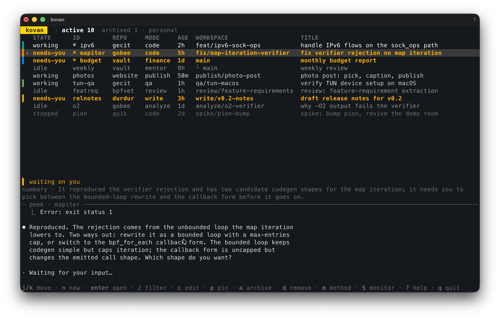
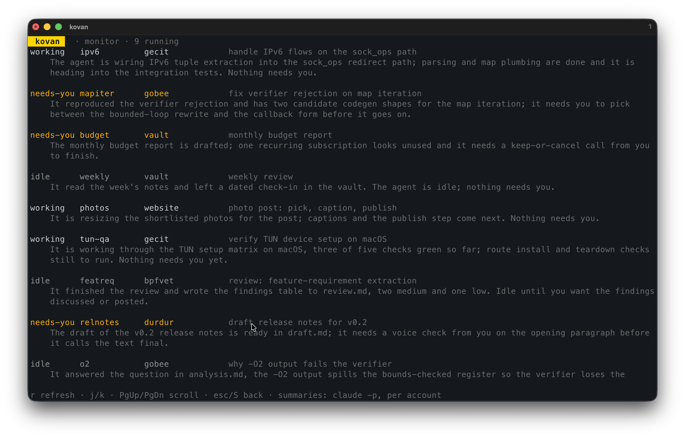

# kovan

> **Teach your engineering methodology once. Every future agent inherits it.**

[](https://goreportcard.com/report/github.com/boratanrikulu/kovan)
[](LICENSE)

AI agents are temporary. Your way of working isn't.

Kovan turns your engineering methodology into infrastructure. Every new agent
inherits it, gates enforce it, and task knowledge survives long after the
agent is gone. Around that core, agents run in isolated worktrees, stay
detached in tmux, and are watched from a single terminal cockpit.

One Go binary. No daemon. No custom runtime.
Kovan doesn't replace Claude Code. It gives it a durable operating environment.


*Every agent is born into this: your global rules, account voice, domain
knowledge, mode workflow, project context, task brief — composed live, plus
the gates that hold it all.*

## what you get

- **your method, everywhere.** rules live once under `~/.kovan` in layers
  (global, per-account, per-domain, per-repo) and compose into every agent via
  `@import`. edit a layer file, every agent picks it up live. modes aren't
  code-only: the same machinery runs a mentor or a finance agent.
- **gates that hold in auto-mode.** `git push`, PR creation, commits on main:
  escalated to you as Claude Code hooks, which fire in every permission mode.
  prose rules slip; hooks don't. your own gates are
  [regex patterns in config](docs/configuration.md#gates) today.
- **tasks that remember.** every task gets a brief, a spec, and a learnings
  file in a durable store outside the worktree. agents come and go, the notes
  accumulate.

## why not just a multiplexer

Multiplexers keep your agents alive. kovan keeps their work disciplined:
written methods, gates the agent can't talk its way past, and task memory
that outlives any session. Good multiplexers exist (claude-squad, herdr) and
kovan overlaps on the worktrees and the board, but it's built for the day
after the demo: you never re-teach an agent your rules, auto-mode can't push
without you, and what an agent learned outlives its worktree. If you want
many providers in one view, use a multiplexer. If you want your agents to
work your way, this is that.


*Full auto-mode, and still: the agent hits a decision that is yours, the row
flips to needs-you, the summary tells you what it wants before you open it.*

The [design doc](docs/design.md) walks the whole machine: how one method
reaches every agent, and why enforcement is hooks, not prose.

## try it in 60 seconds

No tokens, no agents — a seeded fake fleet to walk the cockpit:

```sh
git clone https://github.com/boratanrikulu/kovan && cd kovan
./demo/seed.sh
KOVAN_HOME=/tmp/kovan-demo/home go run ./cmd/kovan
```

(`./demo/teardown.sh` removes every trace.)

## install

```sh
go install github.com/boratanrikulu/kovan/cmd/kovan@latest
```

You need `git`, `tmux`, and the `claude` CLI on PATH. Claude Code is the
supported agent today; Codex support is on the way. Desktop notifications and
clipboard-image paste are macOS; everything else works anywhere Go and tmux
do.

## quickstart

```sh
kovan setup                # once per machine: wire the Claude Code hooks
cd your-repo
kovan init                 # onboard the repo: Claude sorts your AI files into layers
kovan                      # the board
```

Press `n`. One form: id, title, project, where it runs, mode, account, and
the brief written inline (`ctrl+v` pastes a screenshot straight into it).
`ctrl+d` submits; the agent spawns in its own worktree and starts working,
detached.

The agent pauses where your rules say it must. A detached auto-mode agent
that tries to push gets held at an `ask`; the board flips to needs-you, the
summary tells you what it wants, and macOS pings you. You drop in, say go or
steer, detach again.

## the cockpit around it

- **one board, every project.** color-coded states (working, idle, needs-you,
  stopped), a live peek of the selected agent, keyboard and mouse both.
- **summaries instead of tab-cycling.** every running agent gets a one-line
  summary: what it's doing, whether it's blocked on you. on the board, on one
  page (`S`), and in each manifest so your other agents can read the hive too.
- **isolated by construction.** each agent in its own worktree and its own
  plain tmux session you can always attach to yourself. remove the agent,
  keep the branch and the notes.
- **accounts side by side.** personal-plan agents next to company ones; the
  right OAuth token injected per session, never through argv, logs, or the
  manifest.



## docs

- [getting started](docs/getting-started.md) — install to daily loop
- [configuration](docs/configuration.md) — every knob: gates, accounts, modes, apps
- [design](docs/design.md) — the two pillars, the delegation loop, why hooks
- [security](SECURITY.md) — token handling, what the hooks touch
- [contributing](CONTRIBUTING.md)

## status

Personal infrastructure that happens to be public. I use it daily and evolve
it with my own working method; breaking changes land whenever they make the
tool better for me (0.x, no stability promises). Claude Code is the agent it
drives today, with Codex support planned. Issues and PRs are welcome and I
read everything, but support is best-effort and features that don't fit the
philosophy will be kindly declined. Need stability? Pin a version or fork.
